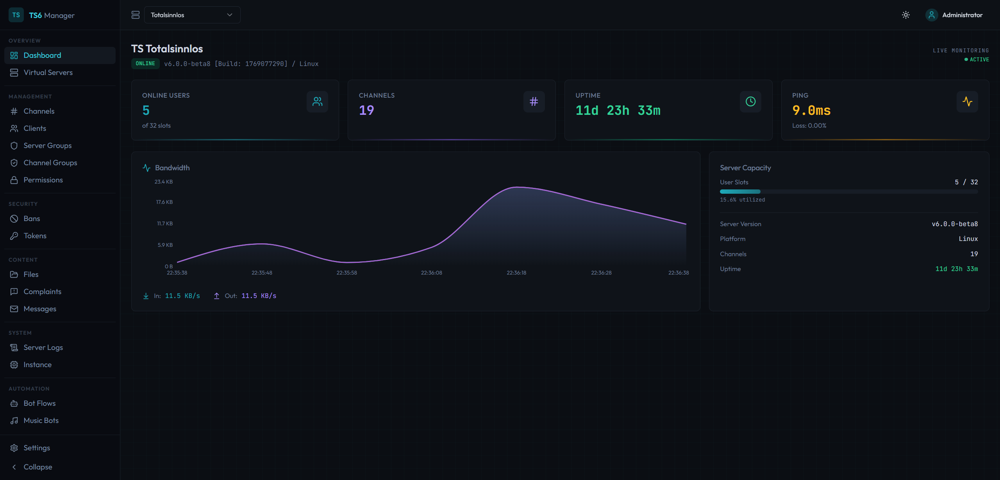
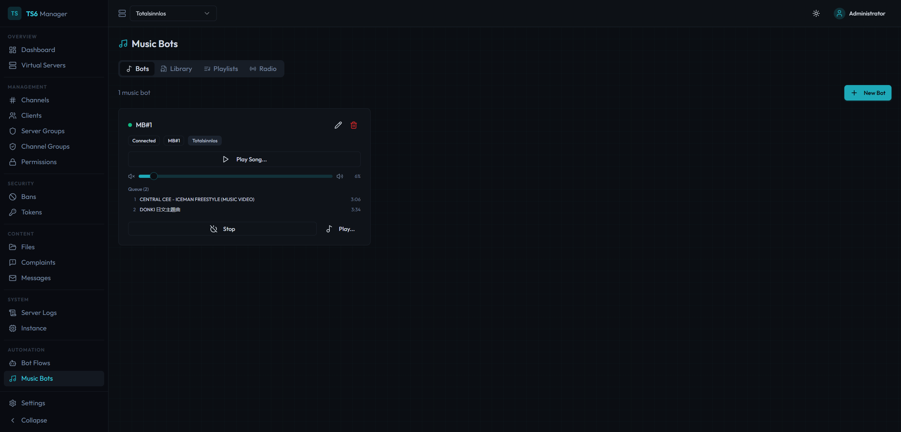
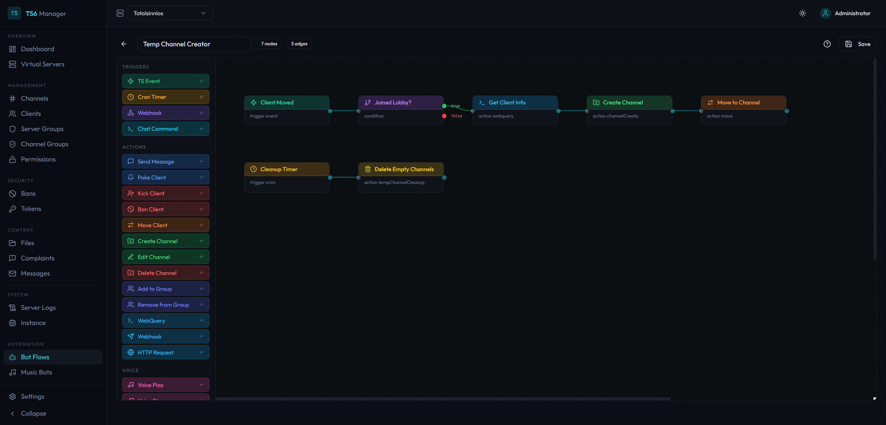
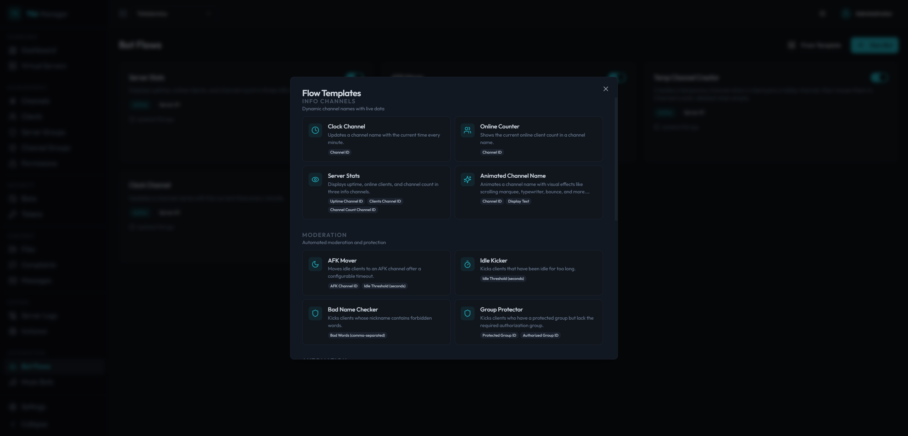

# TS6 Manager

Web-based management interface for TeamSpeak servers. Control virtual servers, channels, clients, permissions, music bots, automated workflows, and embeddable server widgets — all from your browser.

Built on the **WebQuery HTTP API** (the ServerQuery replacement in modern TeamSpeak builds). Telnet is not used or supported.


## Screenshots

### Dashboard
Live overview of your server: online users, channel count, uptime, ping, bandwidth graph, and server capacity at a glance.



### Music Bots
Run multiple music bots per server. Each bot has its own queue, volume control, and playback state. Supports radio streams, YouTube, and a local music library. Users in the bot's channel can control it via text commands (`!radio`, `!play`, `!vol`, etc.).



### Bot Flow Engine
Visual node-based editor for building automated server workflows. Drag triggers, conditions, and actions onto the canvas, connect them, and deploy. Supports TS3 events, cron schedules, webhooks, and chat commands as triggers.



### Flow Templates
Get started quickly with pre-built flow templates. Covers common use cases like temporary channel creation, AFK movers, idle kickers, online counters, and group protection. One click to import, then customize to your needs.



## Features

### Server Management
- Dashboard with live server stats, bandwidth graph, and capacity overview
- Virtual server list with start/stop controls
- Channel tree with drag-and-drop ordering
- Client list with kick, ban, move, poke actions
- Server & channel group management
- Permission editor (server, channel, client, group-level)
- Ban list management
- Token / privilege key management
- Complaint viewer
- Offline message system
- Server log viewer with filtering
- Channel file browser with upload/download
- Instance-level settings

### Music Bots
- Multiple bots per server, each with independent queue and playback
- Radio station streaming with ICY metadata and live title updates
- YouTube playback via yt-dlp (search, download, queue)
- Music library management (upload, organize, playlists)
- Volume control, pause, skip, previous, shuffle, repeat
- Auto-reconnect with exponential backoff on disconnect
- In-channel text commands for hands-free control

### Bot Flow Engine
- Visual flow editor with drag-and-drop node canvas
- Triggers: TS3 events, cron schedules, webhooks (with mandatory secrets), chat commands
- Actions: kick, ban, move, message, poke, channel create/edit/delete, HTTP requests, WebQuery commands
- Conditions, variables, delays, loops, logging
- Animated channel names (rotating text on a timer)
- Placeholder system with filters and expressions
- Pre-built templates for common automation tasks

### Server Widgets
- Embeddable server status banner for websites and forums
- Token-based public access (no authentication required)
- Available as live page, SVG, or PNG image
- Dark and light themes
- Configurable: show/hide channel tree and client list

### Security
- Setup wizard for initial admin account (no default credentials)
- AES-256-GCM encryption for stored credentials (API keys, SSH passwords)
- SSRF protection on all outbound HTTP requests and FFmpeg URLs
- Rate limiting on authentication endpoints
- JWT access + refresh token rotation with reuse detection
- Role-based access control (admin / viewer)
- Per-server access control for multi-tenant setups
- WebQuery command whitelist in bot flows (blocks destructive commands)
- Authenticated WebSocket connections
- Password complexity requirements

## Architecture

```
┌──────────────┐     ┌──────────────┐     ┌─────────────────┐
│   Frontend   │────▶│   Backend    │────▶│  TS Server      │
│  React SPA   │     │  Express API │     │  WebQuery HTTP  │
│  nginx :80   │     │  Node :3001  │     │  SSH (events)   │
└──────────────┘     └──────┬───────┘     └─────────────────┘
                            │
                     ┌──────┴───────┐
                     │   SQLite     │
                     │   (Prisma)   │
                     └──────────────┘

Public:  /widget/:token  ──▶  SVG / PNG / JSON (no auth)
```

**Three packages** in a pnpm monorepo:

| Package | Description |
|---------|-------------|
| `@ts6/common` | Shared types, constants, utilities |
| `@ts6/backend` | Express API, WebQuery client, bot engine, voice bots, widgets |
| `@ts6/frontend` | React SPA with Vite, TailwindCSS, shadcn/ui |

The backend proxies all TeamSpeak API calls. The frontend never has direct access to API keys or server credentials.

## Tech Stack

**Frontend:** React 18, Vite, TailwindCSS, shadcn/ui, TanStack Query + Table, React Flow, Recharts, Zustand

**Backend:** Node.js, Express, Prisma (SQLite), JWT authentication, WebQuery HTTP client, SSH event listener

**Voice/Audio:** Custom TS3 voice protocol client (UDP), Opus encoding, FFmpeg, yt-dlp

## Quick Start (Docker)

1. Download the [`docker-compose.yml`](docker-compose.yml)
2. Create a `.env` file next to it:

```env
JWT_SECRET=your-random-secret-at-least-32-characters
ENCRYPTION_KEY=another-random-secret-for-credential-encryption
```

Generate secure values:

```bash
echo "JWT_SECRET=$(openssl rand -base64 32)" >> .env
echo "ENCRYPTION_KEY=$(openssl rand -base64 32)" >> .env
```

3. Start the stack:

```bash
docker compose up -d
```

4. Open `http://localhost:3000/setup` and create your admin account
5. Log in, then add your TeamSpeak server connection under **Settings → Connections** (host, WebQuery port, API key)

> `JWT_SECRET` is **required** — the backend will refuse to start in production without it.
> `ENCRYPTION_KEY` is optional but recommended — if not set, `JWT_SECRET` is used as fallback for credential encryption.

### Building from Source

```bash
git clone https://github.com/clusterzx/ts6-manager.git
cd ts6-manager
echo "JWT_SECRET=$(openssl rand -base64 32)" >> .env
echo "ENCRYPTION_KEY=$(openssl rand -base64 32)" >> .env
docker compose -f docker-compose.local.yml up -d --build
```

### Coolify / Reverse Proxy

Use [`docker-compose.coolify.yml`](docker-compose.coolify.yml) as a starting point. Key differences from the standard compose:

- No `ports` section — the reverse proxy handles routing
- Set the domain on the **frontend** service in Coolify (port 80)
- If your TS server runs in a separate Docker network, add it as an external network on the backend service:

```yaml
services:
  backend:
    networks:
      - ts6-network
      - ts-server-net

networks:
  ts-server-net:
    external: true
    name: your-ts-server-network-id
```

## Development

Requires: Node.js 20+, pnpm 9+

```bash
pnpm install
pnpm dev          # starts backend + frontend in parallel
```

Backend runs on `:3001`, frontend on `:5173` (Vite dev server).

### Database

Prisma with SQLite. On first run:

```bash
cd packages/backend
npx prisma migrate deploy
```

The Docker images handle migrations automatically on startup.

## Environment Variables

| Variable | Default | Description |
|----------|---------|-------------|
| `JWT_SECRET` | — | **Required.** Secret for JWT signing. Must be set in production. |
| `ENCRYPTION_KEY` | — | Optional. Dedicated key for AES-256-GCM credential encryption. Falls back to `JWT_SECRET` if not set. |
| `PORT` | `3001` | Backend port |
| `DATABASE_URL` | `file:./data/ts6webui.db` | SQLite database path |
| `JWT_ACCESS_EXPIRY` | `15m` | Access token lifetime |
| `JWT_REFRESH_EXPIRY` | `7d` | Refresh token lifetime |
| `FRONTEND_URL` | `http://localhost:3000` | CORS origin |
| `MUSIC_DIR` | `/data/music` | Directory for downloaded music files |

## Music Bot Text Commands

When a music bot is connected to a channel, users in that channel can control it via chat:

| Command | Description |
|---------|-------------|
| `!radio` | List available radio stations |
| `!radio <id>` | Play a radio station |
| `!play <url>` | Play from YouTube URL |
| `!play` | Resume paused playback |
| `!stop` | Stop playback |
| `!pause` | Toggle pause/resume |
| `!skip` / `!next` | Next track in queue |
| `!prev` | Previous track |
| `!vol` | Show current volume |
| `!vol <0-100>` | Set volume |
| `!np` | Show current track |

## Requirements

- TeamSpeak server with **WebQuery HTTP** enabled (not raw/telnet)
- WebQuery API key (generated via `apikeyadd` or server admin tools)
- SSH access to the TS server (only needed for bot flow event triggers)
- `yt-dlp` and `ffmpeg` installed on the backend (included in the Docker image)


## License

MIT
